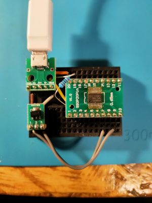
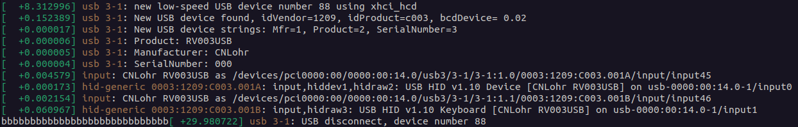
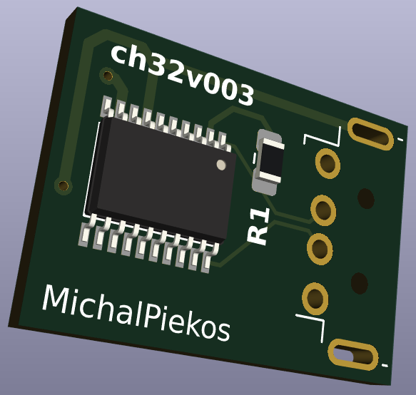

# Cheap mouse jiggler on USB
Simple USB-HID Mouse device on: STM32F103 (bluepill), CH32V003 (10cent RiscV processor).

Idea is to find cheap microcontroller with minimum external components to build mouse jiggler. I am sure no one needs such comparison therefore... here it is. Aliexpress can do it for around 2-2.5$ for ready made USB dongle. I wonder if I can beat that price. I will calculate the price of finished product including PCB, all components like usb plug or socket, resistors, capacitors, crystals, power regulators and what have you. In case of complete boards the price will be the price. I do not calculate shipping costs and USB cable if needed.

1. <b>STM32F103</b> Bluepill The cheapest one I found on aliexpress was for 1.94$ and the price of shipping was reasonable. Mouse jiggler is implemented using STM HAL and it is super easy, especially using CubeIDE or CubeMX environments. Cheap and popular bluepill is then the benchmark in this small test.

2. <b>CH32V003</b> the 0.10$ RiscV microcontroller  Already a strong contender. One would need to create its own PCB. I used slightly changed version of the one that cnlohr posted on his github: https://github.com/cnlohr/rv003usb.   
<b>Pricing: </b>0.23$ for chip and that only when buying 50pcs, 0.62$ for PCB (at least that is my price at one of chinese manufacturers),  LDO was 0.04$ and I will add 0.12$ for capacitors and resistor and 0.08$ for USB male connector. That totals <b>1.09$</b>.  
Probably a winner at this point. 

## CH32V003 Schematics
Provided here is my early breadboard prototype and PCB which I have ordered at one of chinese manufacturers. 
  
Prototype does work: 
  
PCB 3D view 
  

